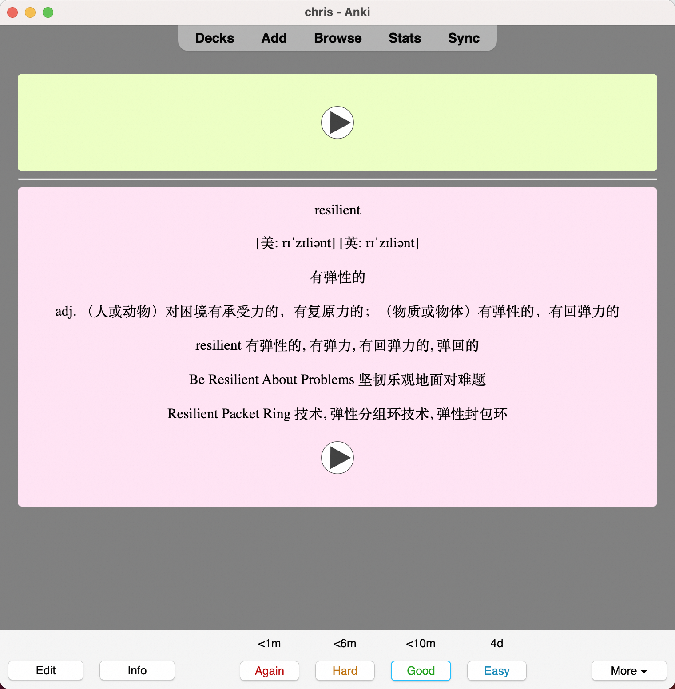
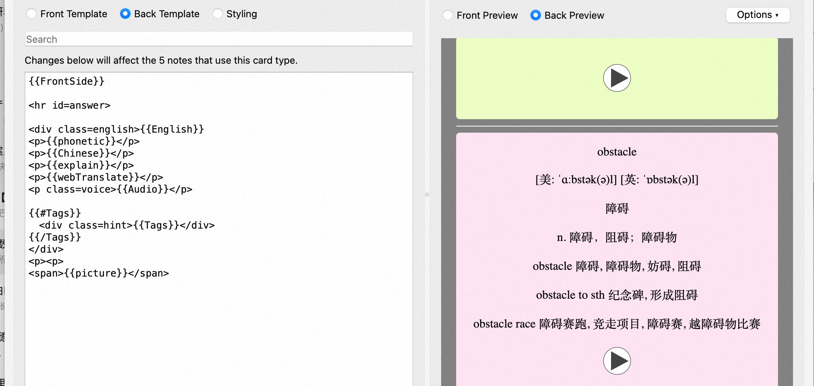

# YoudaoTranslate | 有道翻译

基于[YoudaoTranslate | 有道翻译](https://github.com/wensonsmith/YoudaoTranslator) 加入anki单词同步

产看基础功能请先查看[YoudaoTranslate | 有道翻译](https://github.com/wensonsmith/YoudaoTranslator) 原始项目！！！

### 使用方法

1. 从[release](https://github.com/cswangs/YoudaoTranslator/releases)下载安装最新版alfred插件 `Youdao.Translator.alfredworkflow`
2. 进行初始化配置 如secret和key 目前只支持有道
3. 安装 anki 并下载安装 [ankiConnect插件](https://ankiweb.net/shared/info/2055492159)
4. 可配置node deck 有如下两种方法：
   1. 可以从[release](https://github.com/cswangs/YoudaoTranslator/releases) 下载note.apkg 直接导入（推荐)
   2. 根据更新说明中的模板进行配置（需配置Deck 和Note Type)
5. 使用 alfred 查询单词后按 `ctrl` + `↩︎ Enter` 添加生词到anki  note



### 更新说明

新增了同步[anki](https://ankiweb.net/about) 词汇的功能

同步Anki生词本 -  `ctrl` + `↩︎ Enter` 翻译结果同步到anki的note生词本

可以在变量中配置 deckName 和 modelName

模板中有以下字段可以根据需要再Card中自行配置

```
{
    "English": word,
    "Chinese": translationStr,
    "explain": explain,
    "webTranslate": webTransList,
    "phonetic": phonetic,
    "Audio": `[sound:youdao_${word}.mp3]`
}
```




### 测试·运行·打包

```
nvm use v16.11.1
npm install --force
## 打包
npm run build
## 测试翻译 (注意测试前补充anki.ts 中的key 和secret)
npm run buildtest  'hello'
## 测试anki
npm run buildtest anki 'hello'
```

### Reference

- https://github.com/wensonsmith/YoudaoTranslator
- [https://github.com/joetannenbaum/alfred-workflow](https://github.com/joetannenbaum/alfred-workflow)

* [https://www.alfredapp.com/help/workflows/inputs/script-filter/json/](https://www.alfredapp.com/help/workflows/inputs/script-filter/json/)
* [https://www.alfredapp.com/help/workflows/](https://www.alfredapp.com/help/workflows/)
